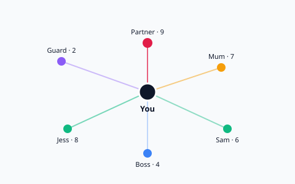

# Relationship Map

Digitises the pen-and-paper exercise: put **yourself in the centre** and draw a
line to everyone in your life — partner, teammates, friends, the security guard
at work — then rate each relationship **1–10** (10 = extremely deep and strong).
Unlike the paper version, this one **remembers**: every rating change is logged,
so you can scrub a time slider and watch your relationships evolve.



## Features

- **Radial map** — you at the centre; each person is a node whose **distance**
  encodes closeness (10 = closest), **colour** encodes their group, and people
  are clustered into arcs by group.
- **Living map + change log** — there's one current map; every closeness change
  is appended to an immutable log with a timestamp and optional note.
- **Time travel** — a slider reconstructs the whole map at any past date from the
  log. Per-person trend charts show closeness over time.
- **Groups** (family / partner / friends / work / …) with custom colours, and a
  **contact-frequency** field per person (separate from emotional closeness).
- **Local-first** — all data lives in a single SQLite file on your disk.

## Stack

- Frontend: React 19 + TypeScript + Vite (hand-rolled SVG, no chart libs).
- Backend: Express + `better-sqlite3`, run with `tsx`.
- Tests: Playwright (e2e against the built app).

## Requirements

- **Node 22** (`nvm use`).
- `better-sqlite3` is a native addon compiled at install time — you need
  **Python 3** and a **C/C++ toolchain** (`build-essential` on Linux, Xcode
  Command Line Tools on macOS). It compiles against the running Node version, so
  install with the same Node you run.

## Install

```bash
nvm use
npm install
```

## Run

**Development** (API on `:8787`, Vite on `:5173` with a `/api` proxy):

```bash
npm run dev
```

Open <http://localhost:5173>.

**Production / preview** (single server serving the built SPA + API on `:8787`):

```bash
npm run build
npm start
# open http://localhost:8787
```

Other scripts: `npm run typecheck`, `npm test` (Playwright), `npm run test:ui`.

## Data, backup & restore

All data lives in **`data/relationship-map.db`** (a SQLite file, plus transient
`-wal` / `-shm` siblings). The whole `data/` folder is gitignored — it's yours to
back up. Override the location with the `DB_PATH` env var.

**Backup** — easiest is a clean single-file snapshot while the app runs:

```bash
sqlite3 data/relationship-map.db "VACUUM INTO 'backup-$(date +%F).db'"
```

Or stop the app and copy `relationship-map.db` together with its `-wal` and
`-shm` files. A JSON dump is also available at `GET /api/export`.

**Restore** — stop the app, replace `data/relationship-map.db` with your backup
(remove any stale `-wal`/`-shm`), then start again.

## Data model

- `people` — name, group, contact frequency, cached `current_rating`, archived.
- `rating_log` — append-only; every closeness change (including the initial one)
  with a timestamp and optional note.
- `categories` — groups with a colour. `settings` — your name (the centre).

The map's live state is a cache; the log is the source of truth, so any past map
can be reconstructed: a person's rating at time *t* is their latest log entry
with `changed_at <= t`.

**v1 simplification:** only *ratings* are versioned over time. A person's group,
contact frequency and archived state reflect their current values in historical
views, not what they were at that moment.
